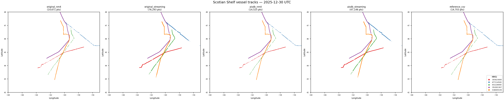
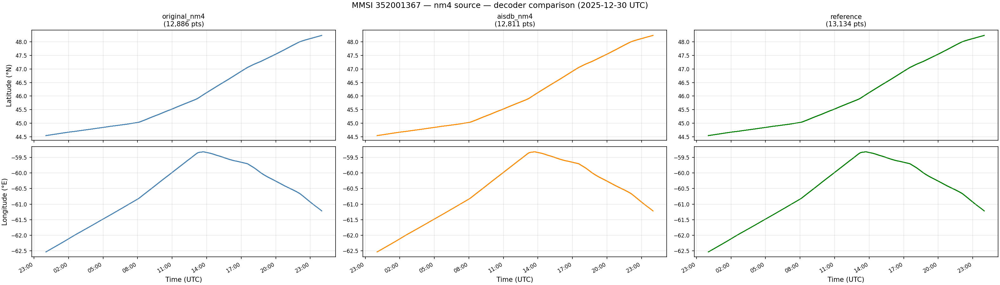
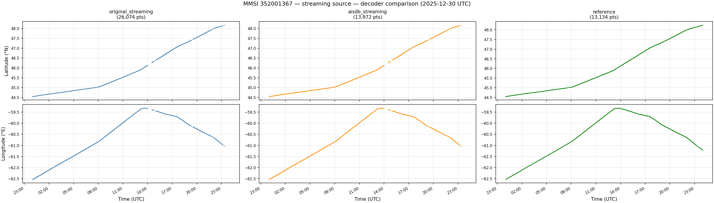
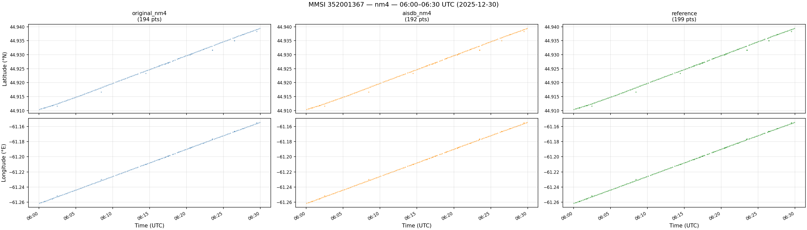
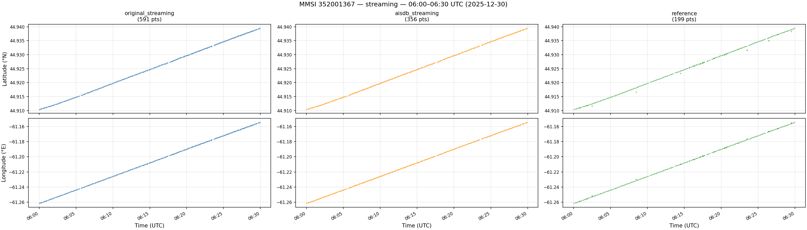

# Monday, June 8 2026

5 MMSI present in all sources, selected for actual movement across the Scotian Shelf. MMSI 352001367 used for lat/lon plots (most position reports + largest spatial spread).

## Full latitude/longitude plots as functions of time

### NM4

### Streaming

## 5 minute interval (06:00–06:30 UTC)

### NM4

### Streaming

---

### Other notes and observations

Output file sizes

**AISdb**
- Streaming: 1.05GB
- NM4: 16.99GB

One .db file for each decoded output using the AISdb script. Dynamic and static data have separate tables inside each .db file.

**Original**
- Streaming: 3.74GB (dynamic) + 452MB (static) = 4.19GB
- NM4: 27.5GB

