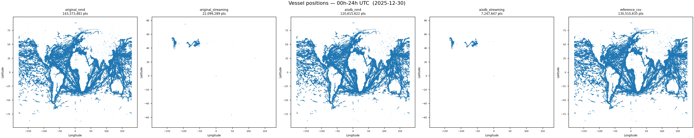
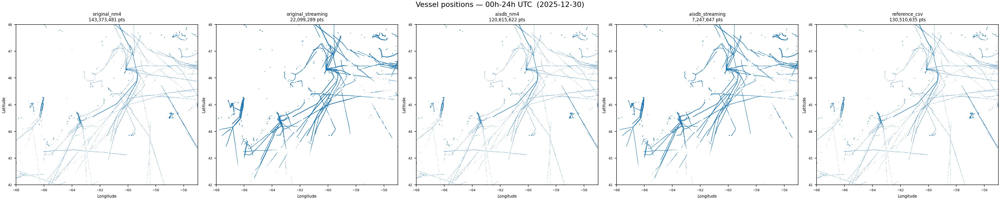

# June 4th, 2026 task: New plots

Full 24h plots of 2025-12-30 UTC sourced from `original_nm4` (143M pts), `original_streaming` (22M pts), `aisdb_nm4` (120M pts), `aisdb_streaming` (7M pts), `reference_csv` (130M pts).

## Global

## Scotian Shelf

using approximate bounds of lon: −68 to −55, lat: 42 to 48.

### Points comparison

| Source | Global pts | Scotian Shelf pts |
|---|---|---|
| original_nm4 | 143,373,481 | 249,162 |
| original_streaming | 22,099,289 | 2,727,398 |
| aisdb_nm4 | 120,833,622 | 231,387 |
| aisdb_streaming | 7,247,847 | 1,280,816 |
| reference_csv | 130,513,435 | 251,506 |

